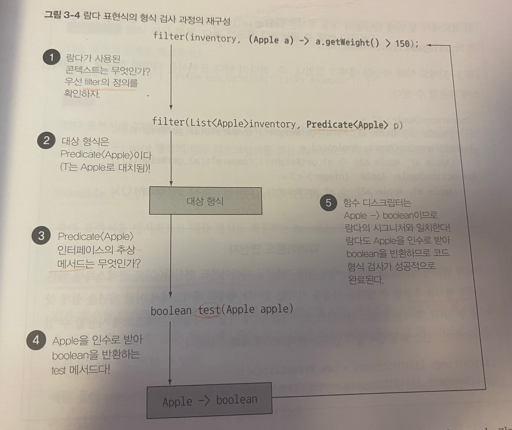

## 3.1 람다란 무엇인가?
- 람다 표현식 : 메스드로 전달 할 수 있는 익명함수를 단순화한 것 
- 특징 
  * 익명 : 이름이 없으므로 익명이라 표현. 구현해야할 코드에 대한 걱정거리 줄어듬
  * 함수 : 특정 클래스에 종속 되지 않아 함수라 부름. 하지만 메서드 처럼 파라미터 리스트, 바디, 반환형식, 가능한 예외리스트를 가짐 
  * 전달 : 람다를 메서드 인수로 전달하거나 변수로 저장 가능 
  * 간결성 : 익명클래스 처럼 자질구레한 코드 구현 필요 없음 
    

- 2장의 동작파라미터 형식 코드 쉽게 구현, 간결하고 유연한 코드. 

```java
(Apple al, Apple a2) -> a1.getWeight().compareTo(a2.getWeight());
//파라미터 리스트    화살표   람다바디
```
- 파라미터 리스트 : Comparator의 compare메서드 파라미터(사과두개)
- 화살표 : -> 는 람다의 파라미터 리스트와 바디를 구분 
- 람다바디: 두 사과의 무게를 비교한다. 람다의 반환값에 해당하는 표현식 

```java
//기본문법
(parameter) -> expression
(parameters) -> { statements;}
```

## 3.2 어디에, 어떻게 람다를 사용할까?

- 함수형 인터페이스라는 문맥에서 사용 가능. 

### 3.2.1 함수형 인터페이스 
- 함수형 인터페이스 : 정확히 하나의 추상 메서드를 지정하는 인터페이스. ex) Comparator, Runnable 
  * 디폴트 메서드 (인터페이스의 메서드를 구현하지 않은 클래스를 고려해서 기본 구현을 제공하는 바디를 포함하는 메서드) 다수 있더라고 추상메서드가 하나면 함수형인터페이스 
  
- 람다로 추상메서드 구현을 직접 전달 가능 -> 전체 표현식을 함수형 인터페이스의 인스턴스로 취급 가능 

### 3.2.2 함수 디스크립터

- 함수형 인터페이스의 추상 메서드 시그니처는 람다 표현식의 시그니쳐를 가르킴.
- 함수 디스크립터 : 람다 표현식의 시그니처를 서술하는 메서드. ex) Runnale 의 run() 은 반환값 없는 시그니처
- 람다는 변수에 할당하거나, 함수형 인터페이스를 ㅡ인수로 받은 메서드 전달 가능, 함수형 인터페이스의 추상 메서드 같은 시그니처 갖음
```java
public void process(Runnable r ){
	r.run();
        }
        
process(()-> System.out.println("this is awesome!"));
process(()-> {System.out.println("this is awesome!")} ); 
// 하나의 void메서드 호출은 중괄호 필요 ㄴㄴ
```

## 3.3 람다 활용 : 실행 어라운드 패턴 

- 실행어라운드 패턴 : 초기화/준비 코드 -> 작업A or 작업 B -> 정리/마무리 코드 형식

### 3.3.1 1단계 : 동작 파라미터화를 기억하라. 
```java
  public String processFile() throws IOException {
    try (BufferedReader br = new BufferedReader(new FileReader(FILE))) {
      return br.readLine(); 
    }
  }
```
- 위 코드를 2줄 읽게 하고 싶고 나머지 재사용 하면 좋겠다 -> 동작파라미터화. processFile 메서드로 동작을 전달해야!

### 3.3.2 2단계 : 함수형 인터페이스를 이용해 동작 전달 
```java
  @FunctionalInterface  
  public interface BufferedReaderProcessor {
    String process(BufferedReader b) throws IOException;
  }

  public String processFile(BufferedReaderProcessor p) throws IOException {
	........
  }
```

### 3.3.3 3단계 : 동작 실행 
- 이제 시그니쳐 ( BufferedReader -> String ) 형식 람다 전달 가능 
```java
  public String processFile(BufferedReaderProcessor p) throws IOException {
    try (BufferedReader br = new BufferedReader(new FileReader(FILE))) {
      return p.process(br); //<- BufferedReader객체 처리 
    }
  }
```

### 3.3.4 4단계 : 람다 전달 
```java
    String oneLine = processFile((BufferedReader b) -> b.readLine());
    System.out.println(oneLine);

    String twoLines = processFile((BufferedReader b) -> b.readLine() + b.readLine());
    System.out.println(twoLines);
```

## 3.4 함수형 인터페이스 사용 

- 다양한 람다사용하려면 공통의 함수 디스크림터를 기술하는 함수형 인터페이스 집합이 필요 
- java.util.function 에 여러 새로운 함수형 인터페이스 제공

## 3.4.1 Predicate 

- test 라는 추상 메서드 : 제네릭 T 객체를 인수로 받아 불리언 반환 
- 따로 정의 안하고 바로 사용 가능. 
```java
Predicate<String> nonEmptyStringPredicate = (String) s -> !s.isEmpty();
List<String> nonEmpty = filter(listOfStrings, nonEmptyStringPredicate);
```
- and 나 or 같은 메서드도 있음

### 3.4.2 Consumer 

- accept : T객체 받아 void 반환 
```java
public <T> void forEach(List<T> list , Comsumer<T> c) {
	for(T t : list) {
		c.accept(t);
        }
  }

  forEach(Arrays.asList(1,2,3,4,5), (Integer i )-> Sys.out.println(i));
```

### 3.4.3 Function 

- apply : 제네릭T 받아서 제네릭R 반환 
```java
public <T,R> List<R> map(List<T> list , Function<T,R> f) {
	    List<R> result = new ArrayList<>();
        for(T t : list) {
          result.add(f.apply(t));
        }
        return result;
  }

List<Integer> l = map(
	Array.asList("a","b"), (String s) - > s.lengh()
);
```

- 기본형 특화 : 자바는 참조형(Byte, Integer,Object,List..) , 기본형 (int, double,byte, char) 존재
- 제네릭 파라미터에는 참조형만 사용 가능. (제내릭의 내부 구현때문)
- 박싱 : 기본형을 참조형으로 변환하능 기능 
- 언방식 : 참조형 -> 기본형 변환 
- 오토박싱 : 박싱과 언박싱이 자동으로 
- 박싱한 값은 기본형 감싸는 래퍼 -> 힙에저장, 메모리 더 소비, 가져올때도 메모리 탐색 과정 필요 -> 비용 소모 

- 오토박싱 피할 수 있도록 특별한 버전의 함수형 인터페이스 제공.ex ) IntPredicate, LongBinaryOperator..처럼 형식명 앞에 붙음.
- 각 디스트립터에 맞는 다양한 기본제공 함수형 인터페이스 있음 (표3-2 참고)
  
- 예외, 람다, 함수형 인터페이스의 관계 : 함수형 인터페이스는 예외 던지는 동작 허용x. 예외 던지는 람다 필요시 함수형 인터페이스 직접 작성 또는 try catch로 감싸야

## 3.5 형식 검사, 형식 추론, 제약 

- 람다식 자체에는 람다가 어떤 함수형 인터페이스 구현하는지 정보 포함x. 람다의 실제 형식 파악 필요 

### 3.5.1 형식 검사 

- 람다가 사용되는 콘텍스트 이용해 람사의 형식 추론 가능. 
- 대상 형식 : 어떤 콘텍스트에서 기대회는 람다 표현식의 형식.
  


### 3.5.2 같은 람다, 다른 함수형 인터페이스 

- 대상 형식 특징 때무에 같은 람다 표현식이라도 호한되느 추상 메서드를 가진 다른 함수형 이터페이스로 사용 가능.
- () -> 42 같은 람다를 Callable, PrivilagedAction 에 다 사용 가능

### 3.5.3 형식 추론 

- 자바 컴파일러는 람다 표현식이 사용된 콘텍스트(대상형식) 이용해 관련된 함수형 인터페이스를 추론
- 즉, 대상형식을 이용해서 함수 디스크립터 알 수 있음 -> 컴파일러는 람다의 시그니처도 추론 가능 
```java
Comparator<Apple> c = (Apple a1, Apple a2) -> a1.getWeight().compareTo(a2.getWeight());
Comparator<Apple> c = (a1, a2) -> a1.getWeight().compareTo(a2.getWeight()); // <- 형식추론
```

### 3.5.4 지역변수 사용 

- 람다 캡처링 : 자유변수(파라미터로 넘겨진 변수가 아닌 외부에서 정의된 변수) 활용 가능
```java
int num = 1377;
Runnable r = () -> System.out.println(num);
num = 3246; //<- 컴파일불가~
```
- 람다는 인스턴스 변수, 정적 변수 자유롭게 캡쳐(자신의 바디안 참조) 가능. 
- 하지만. 지역변수는 final로 선언 또는 그렇게 사용되야. 한번만 할당 할 수 있는 지역변수 캡쳐 가능 
- 왜 ? 인스턴스 벼수는 힙에 저장, 지역변수는 스택에 위치. 스레드에서 실행되면 변수할당한 스레드 종료되 할당 해제 됐는데 람다 실행 스레드에서 변수에 접근하려 가능. -> 원래 변수 접근이 아닌 자유지역변수의 복사본 제공 -> 본사본 값이 바뀌지 않아야 -> 한 번만 값 할당

## 3.6 메서드 참조 

- 기존의 메서드 정의를 재활용 해서 람다처럼 전달 가능. 가독성 굿 
```java
    inventory.sort((Apple a1, Apple a2) -> a1.getWeight().compareTo(a2.getWeight()));
    inventory.sort(comparing(Apple::getWeight));
```

### 3.6.1 요약 

- 메서드 참조는 특정 메서드만 호출하는 람다의 축약형. 기존 메서드 구현으로 람다식 생성 가능. 
- 이때 명시적 메서드 명 참조해 가독성 향상. 같은 기능 간결하게 구현 -> :: 이 구분자 사용 
- 메서드 참조를 만드는 방법
  * 정적 메서드 참조 : Integer::parseInt
  * 다양한 형식의 인스턴스 메서드 참조 : String::lenth
  * 기존 객체의 인스턴스 메서드 참조 : expensiveTransaction::getValue
  
- 컴파일러는 메서드 참조가 주어진 함수형 인터페이스와 호환하는지 확인함. 콘텍스트 형식과 일치해야함.

### 3.6.2 생성자참조 

- ClassName::new 처럼 클래스명과 new키워드 사용해 생성자 참조 만들 수 있음 
```java
Supplier<Apple> c1 = Apple::new;
Apple a1 = c1.get();

Function<Integer, Apple> f1 = Apple::new;
Apple a2 = f1.apply(110); // Function 의 apply 메서드에 무게 인수로 넘겨 Apple객체 생성

BiFunction<Color, Integer , Apple> b = Apple::new;
Apple a3 = b.apply(Green,110);

//생성자에 인수 더 받는게 필요하면 public interface TriFunction<T,UmVmR> {..} 직접 구현해 사용 
```

## 3.7 람다, 메서드 참조 활용하기 

### 3.7.1 1단계 : 코드전달 

- sort의 시그니처 : void sort (Comparator<? super E> c)

```java
  public class AppleComparator implements Comparator<Apple>{
      public int compare(Apple a1, Apple a2){
          return a1.getWeight().compareTo(a2.getWeight());
      }
  }
  inventory.sort(new AppleComparator());
```
### 3.7.2 2단계 : 익명 클래스 사용 
```java
  inventory.sort(new Comparator<Apple>() {
      @Override
      public int compare(Apple a1, Apple a2) {
          return a1.getWeight().compareTo(a2.getWeight());
      }
  });
```

### 3.7.3 3단계 : 람다 표현식 사용 

-  디스크립터 (T,T) -> int 인 Comparator 사용
```java
    inventory.sort((Apple a1, Apple a2) -> a1.getWeight().compareTo(a2.getWeight()));
    inventory.sort((a1, a2) -> a1.getWeight().compareTo(a2.getWeight()));
    
    Comparator<Apple> c = Comparator.comparing((Apple a) -> a.getWeight());
    //import static java.util.Comparator.comparing; 
    inventory.sort(comparing(apple -> apple.getWeight()));

```
### 3.7.4 4단계 : 메서드 참조 사용 

- 표현식 인수 깔끔히 전달해 코드 간소화, 의미 명확 
```java
inventory.sort(comparing(Apple::getWeight));
```

## 3.8 람다 표현식을 조합할 수 있는 유용한 메서드 

- 람다 표현식을 조합할 수 있도록 유틸리티 메서드 제공. 

### 3.8.1 Comparator 조합 
```java
Comparator<Appel> c = Comparator.comparing(Apple::getWeight);
```
- 역정렬 : rsversed() 사용 
```java
inventory.sort(comparing(Apple::getWeight).reversed());
```
- Comperator 연결  : thenComparing() 사용 
```java
inventory.sort(comparing(Apple::getWeight).reversed())
        .thenComparing(Apple::getCountry);
```

### 3.8.2 Predicate 조합 

- negate : 프레디케이트 반전 시킬때 
- and : 빨간색이면서 무거운 사과 
- or : 빨생색이면서 무겁운 사과 또는 그냥 녹색 사과 
```java
Predicate<Appe> a = redApple.and(apple-> apple.getWeight() > 150)
                            . or (apple -> Green.equals(a.getColor()));
```

### 3.8.3  Function 조합

- andThen : 주어진 함수를 먼저 적용한 결과를 다른 함수의 입력으로 전달 
- compose : 인수로 주어니 함수를 먼저 실행한 다음에 그 결과를 외부함수의 인수로 제공 
```java
Function<Integer, Integer> f = x -> x + 1;
Function<Integer, Integer> g = x -> x * 2;
Function<Integer, Integer> h = f.andThen(g);
Function<Integer, Integer> i = f.compose(g);
int r1 = h.apply(1); // 4
int r2 = i.apply(1); // 3
```
- 유틸리티 메서드 조합을 통해 다양한 변환 파이프라인 생성 가능. 
