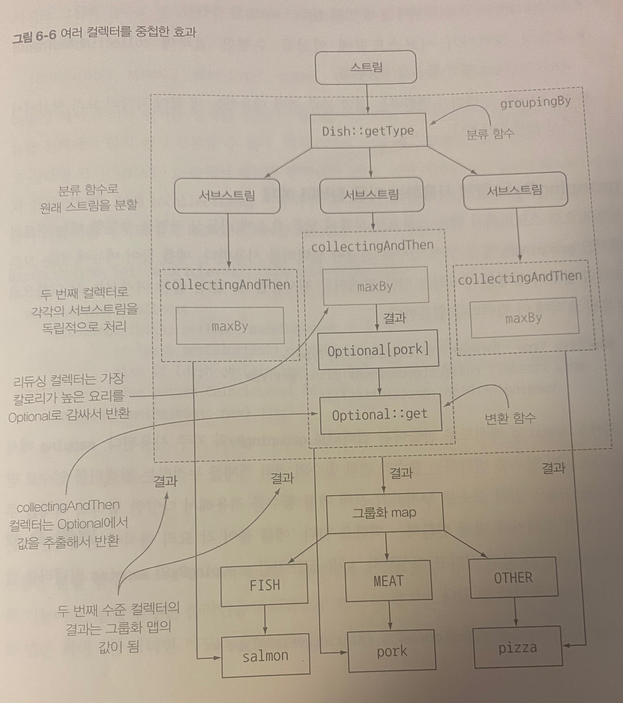

## 6.1 컬렉터란 무엇인가?

- 함수형 프로그래밍에선 무엇을 원하는지 직접 명시 가능. 얻는 방법은 신경x
- Collector 인터페이스 구현은 스트림의 요소를 어떤식으로 도출할지 지정. 

### 6.1.1 고급 리듀싱 기능을 수행하는 컬렉터. 

- collect 장점: 높은 수준의 조합성, 재사용성, 결과 수집 과정을 간단하면서도 유연한 방식으로 정의
- collect 호출하면 스트림 요소에 내부적으로 리듀싱 연산이 수행됨
- 리듀싱 연산을 이용해 스트림의 각 요소를 방문하며 컬렉터가 작업을 처리 
- 함수를 요소로 변환할땐 컬렉터를 적용해 최종겨로가를 저장하는 자료구조에 값을 누적함.
  
  
- Collectors 유틸리티 클래스는 자주 사용하는 인스턴스 쉽게 생성하도록 정적 팩토리 메서드 제공함
```java
List<Transaction> transactions = tarnsactionStream.collecT(Collectors.toList());
```

### 6.1.2 미리 정의된 컬렉터 

- 스트림 요소를 하나의 값으로 리듀스 하고 요약
  - 총합찾는 등 다양한 계산 수행시 
- 요소 그룹화
  - 다수준으로 그룹화, 각 결과 서브구릅에 추가로 리듀싱 연산 적용 하도록 조합 
- 요소 분할 
  - 프레티케이트를 그룹화 함수로 사용 
  
## 6.2 리듀싱과 요약 

- 컬렉터로 스트림의 모든 항목을 하나의 결과로 합칠 수 있다. 
- counting() : import static java.util.stream.Collectors.* 임포트시
```java
long howManyDishes = menu.stream().collect(counting());
```

### 6.2.1 스트림값에서 최댓값과 최솟값 검색 

- Collectors.maxBy, Collectors.minBy : 비교에 사용할 Comparator를 인수로 받음.
```java
   Comparator<Dish> distCaloriesComparator = Comparator.comparingInt(Dish::getCalories);
   Optional<Dish> mostCalorieDish = menu.stream().collect(maxBy(distCaloriesComparator));
```

### 6.2.2 요약연산

- summingInt : 객치를 int로 매핑하는 함수를 인수로 받음. -> 객체를 int로 매핑한 컬렉터를 반환. 
```java
int totalCalories = menu.stream().collect(summingInt(Dish::getCalories));
```
- summingLong, summingDouble도 있음
- averageInt, averageLong, averageDouble 로 평균 계산도 가능 
- summarizingInt : 위 연산 한꺼번에 수행 -> long, double있음
```java
menu.stream().collect(summarizingInt(Dish::getCalories));
// IntSummaryStatistics{count=9, sum=4300, min=120, average=477.777778, max=800}
```

### 6.2.3 문자열 연결 

- joining : 스트림 각 객체에 toString 호출해 각 문자열을 하나의 문자열로 연결해 반환
- 내부적으로 StringBuilder 이용해 하나로 만듬
```java
menu.stream().map(Dish::getName).collect(joining());
menu.stream().map(Dish::getName).collect(joining(", "));
```

### 6.2.4 범용 리듀싱 요약 연산

- 지금까지의 모든 컬렉터는 reducing 팩토리 메서드로도 정의 가능. 즉 Collectors.reducing으로 구현 가능 
- 프로그래밍적 편의성 가독성 때매 컬렉터 사용 
```java
 menu.stream().collect(reducing(0,Dish::getcalories, (i,j)->i+j));
```
- 첫인수 : 리듀싱 연산의 시작값or 인수 없을때 반환값 (0)
- 두번째인수 :변환함수
- 세번째 인수 :  항목을 하나의값으로 더하는 BinaryOperator
```java
Optional<Dish> mostCaloriesDish =menu.stream().collect(reducing((d1, d2) -> d1.getCalories() > d2.getCalories() ? d1 : d2));
```
- 한개 인수로 가지는 reducing버전 : 스트림의 첫 요소를 시작요소로 받고, 자신을 그대로 반환하는 항등함수를 두번째 인수로 받는 상황.  이때 시작값 없을 수 있어 Optional< Dish> 반환

#### 컬렉션 프레임워크 유연성 : 같은 연산도 다양한 방식으로 수행할 수 있다.
```java
      menu.stream().collect(reducing(0,Dish::getCalories,Integer::sum));

      menu.stream().map(Dish::getCalories).reduce(Integer::sum).get(); 
      // Integer::sum 이 Optional<Integer> 반환하니까 get 으로 값 추출. 
      
      menu.stream().mapToInt(Dish::getCalories).sum();
```
#### 자신의 상황에 맞는 최적의 해법 선택 

- 하나의 연산 다양한 방법으로 해결 가능. 
- 스트림 인터페이스에서 직접 제공하는 메서드 이용 보다 컬렉터 이용 코드가 좀 더 복잡. 
- 대신 재사용성, 커스터마이징 가능성 제공 -> 높은 수준의 추상화, 일반화 

## 6.3 그룹화 

- 데이터를 하나 이상의 특성으로 분류해서 그룹화. 
- Collectors.groupingBy 
```java
Map<Dish.Type, List<Dish>> dishesByType = menu.stream().collect(groupingBy(Dish::getType));
//{MEAT=[pork, beef, chicken], FISH=[prawns, salmon], OTHER=[french fries, rice, season fruit, pizza]}
```
- 분류함수를 goupingBy메서드에 전달. 결과로 키와 각 키에 대응하느 스트림의 리스트 값 갖는 매비 반환
- 더 복잡한 분류기준 필요 시 메서드 참조를 분류함소로 사용 불가. 대신 람다 표현식으로 구현
```java
menu.stream().collect(
        groupingBy(dish -> {
          if (dish.getCalories() <= 400) {
            return CaloricLevel.DIET;
          }
          else if (dish.getCalories() <= 700) {
            return CaloricLevel.NORMAL;
          }
          else {
            return CaloricLevel.FAT;
          }
        })
```

### 6.3.1 그룹화된 요소 조작 

- 요소를 그룹화 한 후 각 결과 그룹의 요소를 조작하는 연산 
```java
 menu.stream()
    .filter(dish -> dish.getCalories() > 500)
    .collect(groupingBy(Dish::getType));
// 이렇게 하면 결과 map에 FISH 키가 사라짐 
  menu.stream().collect(
  groupingBy(Dish::getType,
  filtering(dish -> dish.getCalories() > 500, toList())));
```
- filtering 메소드는 프레디케이트를 인수로 받아 각 그룹의 요소와 필터링된 요소를 재그룹화. 

- 매핑함수 로 요소를 변환
```java
menu.stream().collect(
    groupingBy(Dish::getType,
    mapping(Dish::getName, toList())));
```

- 각 그룹이 문자열 리스트일때 
```java
menu.stream().collect(
	groupingBy(Dish::getType,
    flatMapping(dish -> dishTags.get(dish.getName()).stream(), toSet())));
//{MEAT=[salty, greasy, roasted, fried, crisp], FISH=[roasted, tasty, fresh, delicious], OTHER=[salty, greasy, natural, light, tasty, fresh, fried]}
```
### 6.3.2 다수준 그룹화

- 두 인수를 받는 Collectors.groupingBy로 다수준 그룹화 가능.
- 분류함수, 컬렉터를 인수로. 바깥 groupingBy에 스트림 항목을 내부 groupingByd 에 전달해서 두 수준으로 그룹화 
```java
menu.stream().collect(
        groupingBy(Dish::getType, // 첫번째 수준의 분류함수
        groupingBy((Dish dish) -> { // 두번째 수준의 분류함수 
        if (dish.getCalories() <= 400) {
        return CaloricLevel.DIET;
        }
        else if (dish.getCalories() <= 700) {
        return CaloricLevel.NORMAL;
        }
        else {
        return CaloricLevel.FAT;
        }
        })
        )
        );
//{MEAT={NORMAL=[beef], DIET=[chicken], FAT=[pork]}, FISH={NORMAL=[salmon], DIET=[prawns]}, OTHER={NORMAL=[french fries, pizza], DIET=[rice, season fruit]}}
```
- 결과는 n수준 트리구조로 표현되는 n수준 맵 
- groupingBy 연산을 버킷개념으로 생각해 각 groupingBy가 각 키의 버킷을 만들고 각 버킷을 서브스트림 컬렉터로 채워가기 반복 

### 6.3.3 서브그룹으로 데이터 수집

- 첫번째 groupingBy로 넘겨주는 컬렉터의 형식은 제한 없음.
```java
menu.stream().collect(groupingBy(Dish::getType, counting()));
// {MEAT=3, FISH=2, OTHER=4}
```

#### 컬렉터 결과를 다른 형식에 적용하기 

- Collectors.collectingAndThen으로 컬렉터가 반환한 결과를 다른 형식으로 활용 가능 
- 적용할 컬렉터와 변환함수를 인수로 받아 다른 컬렉털르 반환. 
- 반환되는 컬렉터는 기존 컬렉터의 래퍼 역할을 해 collect 마지막 과정에서 변환함수로 자신이 반환하는 값을 매핑
```java
menu.stream().collect(
        groupingBy(Dish::getType, //분류함수
            collectingAndThen(
                maxBy(comparingInt(Dish::getCalories)), // 감싸인 컬렉터
                Optional::get))); //변환함수
//{MEAT=pork, FISH=salmon, OTHER=pizza}
```


#### groupingBy 와 함께 사용하는 다른 컬렉터 예제

- 분류된 요소에 리듀싱작업 수행시 groupingBy에 두번째 인수로 전달한 컬렉터를 사용함. 
```java
menu.stream().collect(groupingBy(Dish::getType,
        summingInt(Dish::getCalories)));
```
- mapping 은 스트림의 인수를 변환하는 함수와 , 변환 함수의 결과 갤체를 누적하는 컬렉터를 인수로 받음.
```java
menu.stream().collect(
        groupingBy(Dish::getType, mapping( //요기 mapping
            dish -> {
              if (dish.getCalories() <= 400) {
                return CaloricLevel.DIET;
              }
              else if (dish.getCalories() <= 700) {
                return CaloricLevel.NORMAL;
              }
              else {
                return CaloricLevel.FAT;
              }
            },
            toSet() // toCollection(HashSet::new) 로 결과 제어 가능
        ))
```
----
## 6.4 분할

- 분할함수 라고 불리는 프레디케이트를 분류 함수로 사용하는 특수한 그룹화 기능
- 맵의 키 형식은 boolean. 결과적으로 최대 두개의 그룹으로 분류(true,false)
```java
  private static Map<Boolean, List<Dish>> partitionByVegeterian() {
    return menu.stream().collect(partitioningBy(Dish::isVegetarian));
  }
  // {false=[pork, beef, chicken, prawns, salmon], true=[french fries, rice, season fruit, pizza]}
```

### 6.4.1 분할의 장점 

- 분할함수가 반환하는 참,거짓 두 요소의 스트림 리스트를 모두 유지함 
- 컬렉터를 두번째 인수로 전달해 오버로드된 partitioningBy 도 있음 
```java
  private static Map<Boolean, Map<Dish.Type, List<Dish>>> vegetarianDishesByType() {
    return menu.stream().collect(partitioningBy(Dish::isVegetarian, groupingBy(Dish::getType)));
  }
  //{false={MEAT=[pork, beef, chicken], FISH=[prawns, salmon]}, true={OTHER=[french fries, rice, season fruit, pizza]}}
```

- 각 그룹에서 가장 칼로리가 높은 요리도 찾을 수 있음 
```java
  private static Object mostCaloricPartitionedByVegetarian() {
    return menu.stream().collect(
        partitioningBy(Dish::isVegetarian,
            collectingAndThen(
                maxBy(comparingInt(Dish::getCalories)),
                Optional::get)));
  }
  //{false=pork, true=pizza}
```
- 

### 6.4.2 숫자를 소수와 비소수로 분할하기
```java
  public static boolean isPrime(int candidate) {
    int candidateRoot = (int) Math.sqrt(candidate);
    return IntStream.rangeClosed(2, candidateRoot)
        .noneMatch(i -> candidate % i == 0);
  }

public static Map<Boolean, List<Integer>> partitionPrimes(int n) {
        return IntStream.rangeClosed(2, n).boxed()
        .collect(partitioningBy(candidate -> isPrime(candidate)));
        }
```

## 6.5 Collector 인터페이스 

- Collecotr 인터페이스는 리듀싱연산을 어떻게 구현할지 제공하는 메서드의 집합으로 구성 
```java
  pulbic interface Collecotr<T, A, R> {
    Supplier<A> supplier();
    BiConsumer<A, T> accumulator();
    Function<A, R> finisher();
    BinaryOperator<A> combiner();
    Set<Characteristics> characteristics();
  }
```
- T는 수집될 스트림 항목의 제네릭 형식
- A 는 누적자, 즉 수집과정에서 중간 결과를 누적하는 객체의 형식
- R 은 수집 연산 결과 객체의 형식 (대게 컬렉션 형식)

### 6.5.1 Collector 인터페이스의 메서드 살펴보기 

#### Supplier 메서드 : 새로운 결과 컨테이너 만들기 

- 빈결과로 이루어진 Supplier반환-> 수집과정에서 빈 누적자 인스턴스를 만드는 파라미터가 없는 함수. 수집과정의 결과
```java
  @Override
  public Supplier<List<T>> supplier() {
    return () -> new ArrayList<T>();
  }
```

#### accumulator 메서드 ; 결과 컨테이너에 요소 추가하기 

- 리듀싱 연산을 수행하는 함수를 반화. n번쨰 요소 탐색시 누적자랑 n번쨰 요소를 함수에 적용 
- 함수에 의해 누적자 내부 상태 바뀌니까 누적자가 어떤값일지 단정 불가.
```java
  public BiConsumer<List<T>, T> accumulator() {
    return (list, item) -> list.add(item);
  }
```

#### finisher 메서드 : 최종 변환값을 결과 컨테이너로 적용하기

- 스트림 탐색을 끝내고 누적자 객체를 최종 결과로 변화하면서 누적 화정을 끝낼때 호출할 함수를 반환해야 함.
```java
  public Function<List<T>, List<T>> finisher() {
    return Function.identity();
  }
  // 누적자가 이미 최종 결과라 항등함수 반환 
```

#### combiner 메서드 ; 두 결과 컨테이너 병합

- 리듀싱 연산에서 사용할 함수를 반환. 
- 스트림의 서로 다른 서브 파트를 병렬로 처리할때 누적자가 이 결과를 어떻게 처리할지 정의 
```java
 public BinaryOperator<List<T>> combiner() {
    return (list1, list2) -> {
      list1.addAll(list2);
      return list1;
    };
  }
```

- 병렬 리듀싱 수행 과정 (Spliterator 7장)
  - 스트림 분할 조건이 거짓으로 바뀌기 전까지 원래 스트림을 재귀적으로 분할 
  - 모든 서브스트림의 각요소에 리듀싱 연산을 순차적 적용해 서브 스트림을 병렬로 처리 
  - combiner 메스다가 반환하는 함수로 모든 부분 결과를 쌍으로 합침 
  
#### Characteristics 메서드 

- 컬렉터의 연산을 정의하는 Characteristics형식의 불변집합을 반환 
  - UNORDERED : 리듀싱 결과는 스트림 요소 방분 순서나 누적 순서에 영향 받지 않음
  - CONCURRENT : 다중 스레드에서 accumulator 함수 동시 호출 가능하고 병렬 리듀싱 수행 가능. 컬렉터 플래그에 UNORDERED함께 설정 안했으면 정렬되지 않은 상황에서만 병렬 리듀싱 수행 가능 
  - IDENTITY_FINISH : finisher메서드가 반환하는 함수는 단순히 identity 를 적용 할 뿐이므로 이를 생략가능. 즉 리듀싱 과정의 최종 결과로 누적자 객체를 바로 사용. 또A 를 R로 안전히 형변환 가능 
  
### 6.5.2 응용하기 
```java
public class ToListCollector<T> implements Collector<T, List<T>, List<T>> {

  @Override
  public Supplier<List<T>> supplier() {
    return () -> new ArrayList<T>();
  }

  @Override
  public BiConsumer<List<T>, T> accumulator() {
    return (list, item) -> list.add(item);
  }

  @Override
  public Function<List<T>, List<T>> finisher() {
    return i -> i;
  }

  @Override
  public BinaryOperator<List<T>> combiner() {
    return (list1, list2) -> {
      list1.addAll(list2);
      return list1;
    };
  }

  @Override
  public Set<Characteristics> characteristics() {
    return Collections.unmodifiableSet(EnumSet.of(IDENTITY_FINISH, CONCURRENT));
  }

}
```

#### 컬렉터 구현을 만들지 않고도 커스텀 수집 수행하기 

- stream은 세함수 (발행,누적,함침) 를 인수로 받는 collect메서드를 오버로드하며 각가의 메서드는 Collector인터페이스의 메서드가 반환하는 함수와 같은 기능 수행. 
```java
List<Dish> dishes = menuStream.collect(
        ArrayList::new,
    List::add,
    List::addAll
        );
```
- 코드 간결,축약 but 가독성 떨어짐. 적절히 커스텀 컬렉터 구현해야 중복 피하고 재사용성 높일 수 있음 

## 6.6 커스텀 컬렉터를 구현해서 성능 개선하기 

### 6.6.1 소수로만 나누기 

- 지금까지 발견한 소수 리스트 사용해 그것으로 나누고싶음 -> 커스텀 컬렉터 클래스 
```java
  public static boolean isPrime(List<Integer> primes, Integer candidate) {
    double candidateRoot = Math.sqrt(candidate);
    return primes.stream().takeWhile(i -> i <= candidateRoot).noneMatch(i -> candidate % i == 0);
  }
```

#### 1단계 : Collector클래스 시그니처 정의 

- 스트림요소의 형식 / 누적자 형식/ 수집연산의 결과 형식

#### 2단계 : 리듀싱 연산 구현

- supplier : 누적자를 만드는 함수를 반환 . 누적자로 사용할 맵을 true, false 키, 빈리스트로 초기화
- accumulator : 최적화의 핵심. 수집과정의 중간결과(소수리스트) 누적자에 접근 가능. 

#### 3단계 : 병렬 실행할 수 있는 컬릭터 만들기(가능하다면)

- 병렬수집과정에서 두 부분 누적자를 합실 수 있는 메서드 만듬. 
- 알고리즘 자체가 순차적이어서 병렬 사용 불가. 그냥 빈구현으로 두거나 exception 던지기 가능
#### 4단계 : finisher 메서드와 컬렉터의 characteristics메서드 

- accumulator 형식과 결과 형식 같아 변환 과정 필요 x. -> 항등함수 identity를 반화하도록 finisher 구현 
- CONCURRENT, UNORDERED 아sls IDENTITY_FINISH 구현  
```java
  public static class PrimeNumbersCollector
      implements Collector<Integer, Map<Boolean, List<Integer>>, Map<Boolean, List<Integer>>> {

    @Override
    public Supplier<Map<Boolean, List<Integer>>> supplier() {
      return () -> new HashMap<>() {{
        put(true, new ArrayList<Integer>());
        put(false, new ArrayList<Integer>());
      }};
    }

    @Override
    public BiConsumer<Map<Boolean, List<Integer>>, Integer> accumulator() {
      return (Map<Boolean, List<Integer>> acc, Integer candidate) -> {
        acc.get(isPrime(acc.get(true), candidate))// isPrime 의 결과에 따라 소수리스트와 비소수 리스트를 만듬
            .add(candidate); // candidate를 알맞은 리스트에 추가함 
      };
    }

    @Override
    public BinaryOperator<Map<Boolean, List<Integer>>> combiner() {
      return (Map<Boolean, List<Integer>> map1, Map<Boolean, List<Integer>> map2) -> {
        map1.get(true).addAll(map2.get(true));
        map1.get(false).addAll(map2.get(false));
        return map1;
      };
    }

    @Override
    public Function<Map<Boolean, List<Integer>>, Map<Boolean, List<Integer>>> finisher() {
      return i -> i;
    }

    @Override
    public Set<Characteristics> characteristics() {
      return Collections.unmodifiableSet(EnumSet.of(IDENTITY_FINISH));
    }

  }
```

### 6.6.2 컬렉터 성능 비교 

- 간단한 하니스 만들어서 성능 측정 
```java
  private static long execute(Consumer<Integer> primePartitioner) {
    long fastest = Long.MAX_VALUE;
    for (int i = 0; i < 10; i++) {
      long start = System.nanoTime();
      primePartitioner.accept(1_000_000);
      long duration = (System.nanoTime() - start) / 1_000_000;
      if (duration < fastest) {
        fastest = duration;
      }
      System.out.println("done in " + duration);
    }
    return fastest;
  }
```