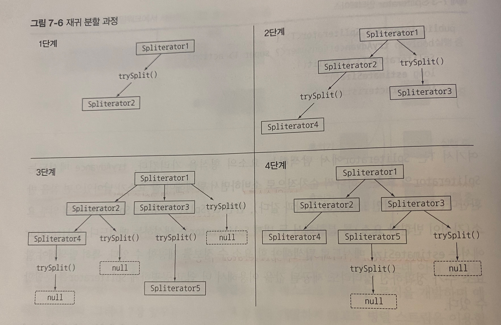
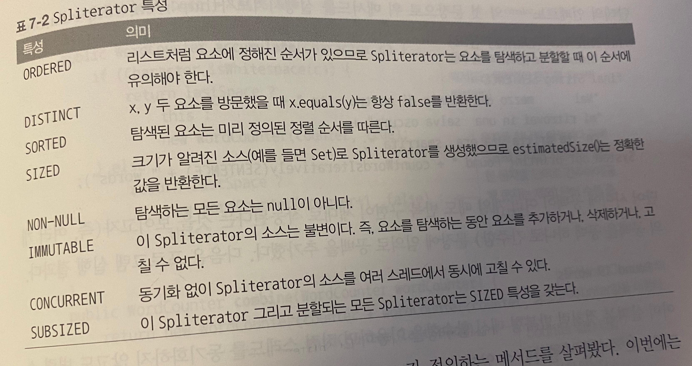

## 7.1 병렬 스트림 

- parallelStream호출시 병렬 스트림이 생성됨. 
- 병렬스트림 : 각 스레드에서 처리할 수 있또록 스트림 요소를 여러 청크로 분할한 스트림 
- 모든 멀티코어 프로세서가 각 청크를 처리하도록 할당. 

### 7.1.1 순차 스트림을 병렬 스트림으로 변환하기 

```java
public long parallelSum() {
    return Stream.iterate(1L, i -> i + 1)
    .limit(N)
    .parallel() //병렬
    .reduce(0L, Long::sum);
  }
```
- 여러 청크를 병렬로 수행 , 리듀싱 연산으로 생성된 부분결과를 다시 리듀싱 연산으로 합쳐 결과 도출 
- sequential() 설정하면 병렬스트림을 순차 스트림으로 바꿀 수 있음. 
- parallel, sequential 로 병렬,순차 제어 가능. 

### 7.1.2 스트림 성능 측정 

- 성능 측정은 최적화의 황금 규칙. 벤츠마크 구현해야. 
- 힙의 크리 충분히 설정, 매 종료마다 가비치 컬렉터 실행되도록.
- 병렬이 순차버전에 비해 훨씬 느림 
  - 반복 결과로 박싱된 객체가 만들어지므로 숫자를 더하려면 언박싱 해야.
  - 반복 자겅ㅂ은 병렬로 수행할 수 있는 독립 단위로 나누기가 어렵
- 병렬의 오용은 전체 프로그램의 성능 하락 가능

#### 더 특화된 메서드 사용 

- LongStream.rangeClosed 
  - LongStream.rangeClosed 는 long기본형 직접 사용해 박싱과 언박싱 오버헤드 사라짐 
  - 쉽게 청크로 분할 할 수 있는 숫자 범위를 생산함.
- 알고리즘 병렬화 보단 적절한 자료구조 선택이 더 중요. 
- 병렬화 위해선 스트림을 재귀적 분할하고, 각 서브스트림을 서로 다른 스레드의 리듀싱연산으로 할당하고,  결과를 합쳐야 해서 비쌈. 
- 코어 간에 데이터 전송 시간보다 훨씬 오래 걸리는 작업만 병렬로 다른 코어에서 수행하는것이 바람직

### 7.1.3 병렬 스트림의 올바른 사용법 

- 공유된 상태를 바꾸는 알고리즘 사용 하면 참사 
```java
  public static long sideEffectSum(long n) {
    Accumulator accumulator = new Accumulator();
    LongStream.rangeClosed(1, n).forEach(accumulator::add);
    return accumulator.total;
  }
public static class Accumulator {
	private long total = 0;
	public void add(long value) {
		total += value;
	}
}
```
- total 접근마다 데이터 레이스 문제가 일어남 

### 7.1.4 병렬 스트림 효과적으로 사용하기 

- 직접 측정해라. 무조건 병렬이 좋은게 아니니 적철한 벤치마크로 직접 성능 측정해
- 박싱을 주의해라. 기본형 특화 스트림 활용 
- limit, findFirst 처럼 요소 순서에 의존하는 연산은 병렬에 비싼 비용. 순서 노상관이면 비정렬 스트림에 limit호출이 효과적 
- 전체 파이프라인 연산 비용을 고려. 요소수N , 하나 요소 처리 비용 Q면 처리비용은 N*Q. Q가 높으면 병렬로 성능 개선 가능
- 소량의 데이터 에는 병렬 별 도움 x. 
- 스트림 구성 자료구조 적절한지 확인. LinkedList보다 ArrayList가 더 잘 분할됨. range팩토리 메서드도 가능
- 중간연산이 스트맄 특성 어케 바꾸지는 따라 분해과정 성능 다름. SIZED는 같게 분활할 수 있어 효과적. / 필터연산있으면 길이 예측 불가해 별로 
- 최종 연산의 병합과정 비용 살피기. 

----

## 7.2 포크/조인 프레임 워크 

- 병렬화 할 수 있는 작업을 재귀적으로 작은 작업으로 분할해 각 서브테스크 결과 합쳐서 전체 결과를 만들도록 설계
- 서브테스트를 스레드 풀의 작업제 스레드에 분산 할당하는 ExecutorService인터페이스 구현함. 

### 7.2.1 Recursive Task 활용 

- 스레드풀 이용 위해 RecursiveTask<R> 의 서브 클래스 만들어야. R은 병렬화된 태스크가 생성하는 결과가 없을때 RecursiveAction형식. compute 추상메서드 구현.
- compute : divide and conquer 의 병렬화 버전 
```java
if(태스크가 충분히 작거나 분해불가){
	순차적 태스크 계산
} else {
    태스크를 두 서브태스크로 분할
    태스크가 다시 서브태스크로 분할되도록 이 메서드 재귀적 호출
    모든 서브태스크의 연산이 완료되길 기다림 
    각 서브태스크의 결과 합침. 
}
```
```java
public class ForkJoinSumCalculator extends RecursiveTask<Long> { // RecursiveTask 상속받아 태스크 생성 

  public static final long THRESHOLD = 10_000; // 이값 이하는 분할x 

  private final long[] numbers;
  private final int start;
  private final int end;

  public ForkJoinSumCalculator(long[] numbers) { //메인 태스크 생성시 사용할 공개 생성자 
    this(numbers, 0, numbers.length);
  }

  private ForkJoinSumCalculator(long[] numbers, int start, int end) { // 서브태스크를 재귀적으로 만들때 사용할 비공개 생성자
    this.numbers = numbers;
    this.start = start;
    this.end = end;
  }

  @Override
  protected Long compute() { // 추상메서드 오버라이드
    int length = end - start; //이 태스크에서 더할 배열의 길이 
    if (length <= THRESHOLD) {
      return computeSequentially(); // 기준값보다 작거나 같으면 순차적 결과 계산
    }
    ForkJoinSumCalculator leftTask = new ForkJoinSumCalculator(numbers, start, start + length / 2); // 배열의 첫번째 절반을 더하도록 서브태스크 생성
    leftTask.fork(); //ForkJoinPool 의 다른 스레드로 새 태스크를 비동기 실행 
    ForkJoinSumCalculator rightTask = new ForkJoinSumCalculator(numbers, start + length / 2, end); // 배열 나머지 절반 더하도록 서브태스크 생성
    Long rightResult = rightTask.compute(); // 두번째 서브태스크 동기 실행. 추가 분할 가능성 있음
    Long leftResult = leftTask.join(); // 첫 서브태스크의 결과 읽거나 없으면 기다림
    return leftResult + rightResult;// 두 서브태스크 결과 조합한 값 
  }

  private long computeSequentially() { // 더 불할 불가할때 서브태스크 결과 계산하는 단순 알고리즘
    long sum = 0;
    for (int i = start; i < end; i++) {
      sum += numbers[i];
    }
    return sum;
  }

  public static long forkJoinSum(long n) { //생성자로 원하는 수의 배열 넘길 수 있음
    long[] numbers = LongStream.rangeClosed(1, n).toArray();
    ForkJoinTask<Long> task = new ForkJoinSumCalculator(numbers);
    return FORK_JOIN_POOL.invoke(task);
  }

}

```
- ForkJoinPool 을 한번만 인스턴스화 해서 정적 필드에 싱글턴 저장해 필요한 곳에서 사용. 
- 인수 없는 디폴트 생성자 이용 -> jvm에서 모든 프로세서가 자유롭게 풀에 접근하도록. 

#### ForkJoinSumCalculator 실행 

- ForkJoinSumCalculator 를 ForkJoinPool로 전달하면 풀 스레드가 compute메서드 실행하며 작업 수행.
- 재귀적으로 반복되면서 주어진 조건을 만족할때까지 태스크 분할 반복
- 각 서브태스크 순차적 처리되면 포킹 프로세스로 만들어진 이진트리 태스크루트에서 역순으로 방문 -> 부분결과 합쳐서 최종결과로 

### 7.2.2 포크/조인 프레임워크를 제대로 사용하는 방법 

- join() :  태스크결과 나올떄까지 기다림. 두 서브 태스크 모두 시작 된 후에 호출해야. 
-  RecursiveTask내에서는 ForkJoinPool의 invoke메서드 사용 말아야. 대신 compute나 fork메서드를 직접 호출 가능. 순차코드에서 병렬 계산 시작할때만 invoke
- 서브태스크에 fork메서드 호출해서 ForkJoinPool 일정 조정 가능. 한쪽작업 에는 fork보단 compute가 효율적. -> 같은 스레드 재 사용해 오버헤드 피함 
- 포크/조인 프레임워크 병렬 계산은 디버깅 힘듬. 
- 순차보다 무조건 빠르지 않음. 각 서ㅡ태스크 실행시간은 새로운 태스크 포킹하는데 드는 시간보다 길어야. 
여러번 성능 측정 후 적용해야. 
  
### 7.2.3 작업 훔치기 

- 코어 개수와 관계 없이 적절한 크기로 분할된 많은 태스크를 포킹하는게 바람직. 
- 현실에서는 각 서브태스크 작업 완료 시간 다름 
- 작업훔치기 : 모든 스레드를 거의 공정하게 분할 -> 각 스레드는 자신에게 할당된 태스크 포함하느 ㄴ이중 연결 리스트 참조하며 작업 끝날때 마다 큐의 헤드에서 다른 태스크 가져와 작업 처리 
- 할이 없어진 스레드는 다른 스레드 큐의 꼬리에서 작업을 훔쳐옴. 
- 태스크 크기 작게 나누어야 스레드 간 작업 부하를 비슷하게 유지 가능. 

## 7.3 Spliterator 인터페이스 

- 분할할 수 있는 박복자. 소스이 요소탐색 기능 + 병렬작업에 특화 
- 자바 8 은 모든 자료구조에 사용 가능한 디폴트 Spliterator구현 제공.
- tryAdvancd : Spliterator요소 하나씩 순차적 으로 소비하며 탐색할 요소 있으면 true반환
- trySplit : Spliterator의 일부요소를 분할해 두번째 Spliterator 생성
- estimateSize : 탐색할 요소 수 정보 제공 

### 7.3.1 분할과정 

- 재귀적으로 분할.
  
  
#### Spliterator특성

- Characteristics 추상메서드. Spliterator자체의 특성 집합을 포함하는 int를 반환.
  
  
### 7.3.2 커스텀 Spliterator 구현하기 
pass..